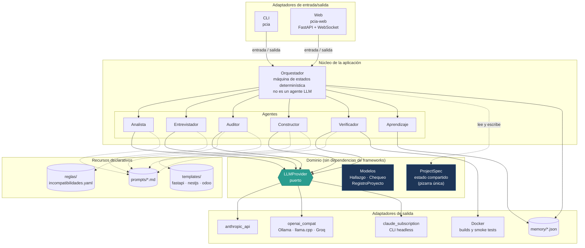
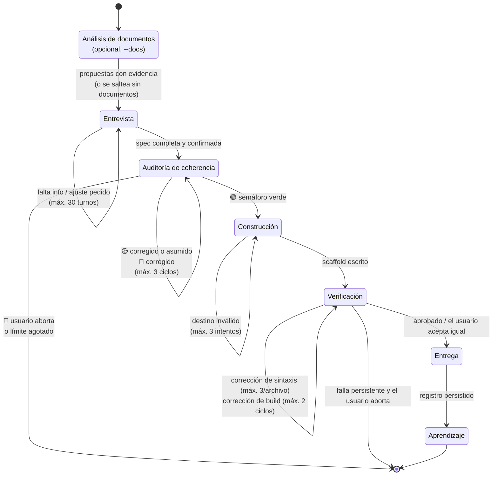
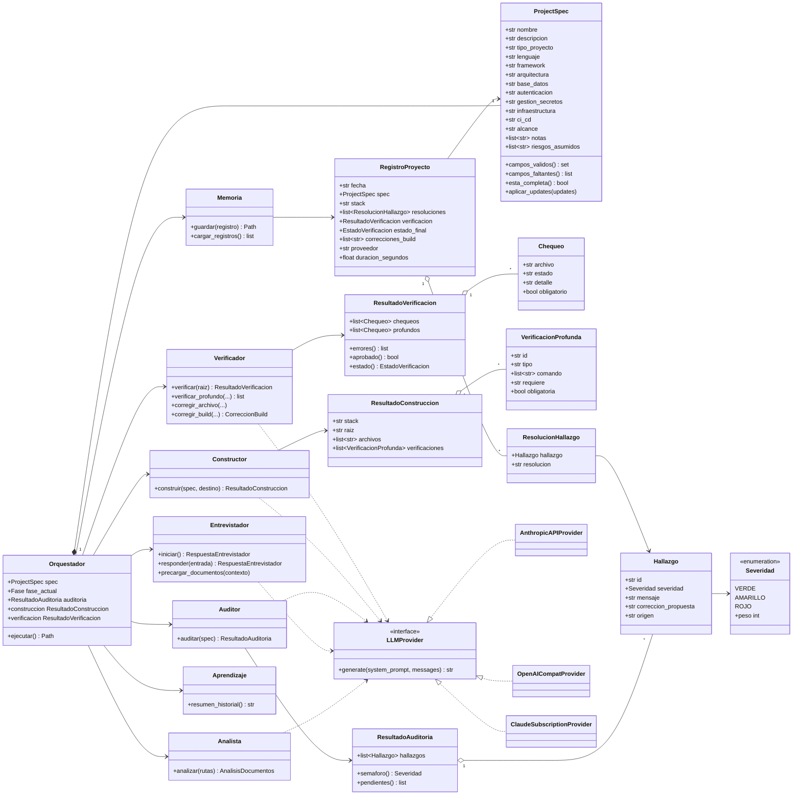

# Arquitectura — diagramas

Diagramas derivados del código real (`src/pcia/`). Complementan el diseño conceptual de
[`DISENO.md`](DISENO.md).

---

## 1. Arquitectura de componentes (hexagonal)

El dominio no conoce ni a los adaptadores ni a los frameworks. Toda interacción con modelos
de IA cruza el puerto `LLMProvider`; toda interacción con el usuario cruza los callables de
IO del orquestador. Por eso la consola y el navegador son intercambiables.

**Reglas no negociables que el diagrama hace visibles:**

- Los agentes **no se comunican entre sí**: comparten estado a través de la `ProjectSpec`.
- Ningún agente llama a un proveedor de IA directamente; todos pasan por `LLMProvider`.
- Las reglas de auditoría, las plantillas y los prompts son **datos versionados**, no código.

---

## 2. Máquina de estados del ciclo

El orquestador es código determinístico. Cada fase devuelve la siguiente; los ciclos de
corrección viven **dentro** de su fase y todos tienen límite explícito.

**Los dos bucles de retroalimentación tienen propósitos distintos**: el de coherencia valida
la *decisión* antes de construir nada; el de corrección valida la *ejecución* de lo
construido.

---

## 3. Diagrama de clases (UML)

Modelo de dominio, puerto de IA y agentes. Los agentes son *stateless* respecto del ciclo:
reciben la `ProjectSpec` y devuelven un resultado tipado.

---

## 4. Secuencia de una corrida real

Corrida verificada end-to-end: especificación incoherente (serverless + WebSockets) que el
Auditor bloquea, se corrige, y termina con build y smoke test reales en Docker.

```mermaid
sequenceDiagram
    autonumber
    actor U as Usuario
    participant O as Orquestador
    participant E as Entrevistador
    participant A as Auditor
    participant C as Constructor
    participant V as Verificador
    participant M as Memoria
    participant L as LLMProvider

    U->>O: pcia-web
    O->>E: iniciar()
    E->>L: generate(prompt entrevistador)
    L-->>E: {message, updates, done:false}
    E-->>U: "¿Qué proyecto querés crear?"
    U->>E: "chat de soporte en tiempo real"
    E->>L: generate(...)
    L-->>E: {updates: spec completa, done:true}
    E-->>O: spec completa
    O->>U: "¿Confirmás la especificación?"
    U-->>O: (enter)

    rect rgb(60, 30, 30)
    Note over O,A: Ciclo de coherencia
    O->>A: auditar(spec)
    A->>A: matriz de reglas determinísticas
    A->>L: pase LLM (lo no catalogado)
    A-->>O: 🔴 serverless-websockets (bloqueante)
    O->>U: "es bloqueante, no puede asumirse"
    U-->>O: aplicar corrección propuesta
    O->>E: responder(hallazgo + decisión)
    E->>L: generate(...)
    E-->>O: infraestructura → docker
    O->>A: auditar(spec)
    A-->>O: 🟢 verde
    end

    O->>C: construir(spec, destino)
    C->>C: render plantilla + condicionales<br>(PostgreSQL → compose + db.py)
    C->>L: generate(README y ADR)
    C-->>O: 15 archivos

    rect rgb(30, 50, 40)
    Note over O,V: Verificación
    O->>V: verificar(raiz)
    V-->>O: sintaxis 11 ok, 0 errores
    O->>V: verificar_profundo(...)
    V->>V: docker build ✅<br>smoke test ✅<br>ruff ⏭️ (opcional, ausente)
    V-->>O: aprobado con advertencias
    end

    O->>M: guardar(RegistroProyecto)
    M-->>O: memory/chat-soporte-*.json
    O-->>U: ⚠️ aprobado con advertencias
```

